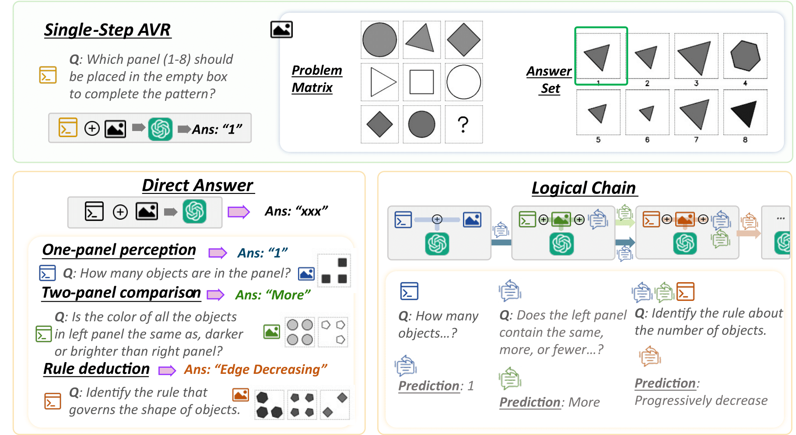
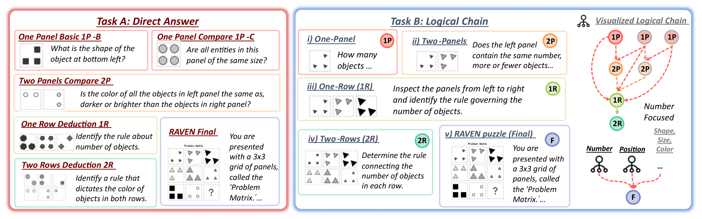

# Beyond Perception: Evaluating Abstract Visual Reasoning through Multi-Stage Task
Repository for MultiStAR Benchmark

## Abstract
Current Multimodal Large Language Models (MLLMs) excel in general visual reasoning but remain underexplored in Abstract Visual Reasoning (AVR), which demands higher-order reasoning to identify abstract rules beyond simple perception. Existing AVR benchmarks focus on single-step reasoning, emphasizing the end result but neglecting the multi-stage nature of reasoning process. Past studies found MLLMs struggle with these benchmarks, but it doesn't explain how they fail. To address this gap, we introduce MultiStAR, a Multi-Stage AVR benchmark based on RAVEN, to assess reasoning across varying levels of complexity. Additionally, existing metrics like accuracy only focus on the final outcomes while do not account for the correctness of intermediate steps. Therefore, we propose a novel metric, MSEval, which considers the correctness of intermediate steps in addition to the final outcomes. We conduct comprehensive experiments on MultiStAR using 17 representative close-source and open-source MLLMs. The results reveal that while existing MLLMs perform adequately on basic perception tasks, they continue to face challenges in more complex rule detection stages.

 
 


## Dataset
### Download
**You may direct download MultiStAR from [here](https://drive.google.com/file/d/1TQLD4pK7C7ERM5qMa7YCey0Sq9_MMs9J/view?usp=drive_link).**

**Alternatively, you may run the code to generate the dataset by following the [instructions](#Setup).**

### Dataset Structure Description
#### Direct Answer (under "dataset" folder): 

This dataset contains seven Configurations (same as RAVEN) and is organized in JSON format and contains the following main fields:

- **`question_num`**: The total number of questions in the current sample.
- **`rules`**: Defines the logical rules applied to the visual patterns (e.g., shape progression, color consistency).
- **`panels`**: Describes each visual panel, including attributes like position, shape, size, and color of the objects.

Each **`questions`** entry contains the following fields:

- **`filename`**: The name of the source annotation file (e.g., from RAVEN or other templates).
- **`question`**: The question.
- **`answer`**: The correct answer choice label (e.g., "A", "B", "C", or "D").
- **`template_filename`**: The filename of the template used to generate the question.
- **`choices`**: A list of multiple-choice answer options, each prefixed with a label (e.g., "A: 7").
- **`config`**: The configuration of the panel layout, such as object position or type (e.g., "center_single").
- **`image_filename`**: The path to the panel image associated with the question.

#### Logical Chain (in the file "logical_chain_questions.json")

- **`question`**: The question.
- **`choices`**: A list of answer options, each labeled (e.g., `"A: 1"`).
- **`correct_answer`**: The correct answer label (e.g., `"A"`, `"B"`).
- **`config`**: RAVEN configurations.
- **`image_path`**: Image path.
- **`stage`**: Indicates the subtask or reasoning stage (e.g., `"single_panel_1_left"`), useful for multi-stage reasoning pipelines.
- **`attribute`**: The target visual attribute in the question (e.g., `"number"`, `"position"`, `"shape"`).

## Setup
### Requirements
* cv2
* numpy
* tqdm
### File and Package Required
Download original RAVEN dataset and unzip it under the **`./RAVEN`** directory [RAVEN.zip](https://drive.google.com/file/d/1rmg_Eavn-EZ5bas4XI4yIWFIV-3fJ-M4/view?usp=sharing).

### Run
Run **`./generate_dataset.sh`**

## 📚 Citation

If you find this dataset useful in your research or work, please consider citing:

```bibtex
@misc{jiang2025perceptionevaluatingabstractvisual,
      title={Beyond Perception: Evaluating Abstract Visual Reasoning through Multi-Stage Task}, 
      author={Yanbei Jiang and Yihao Ding and Chao Lei and Jiayang Ao and Jey Han Lau and Krista A. Ehinger},
      year={2025},
      eprint={2505.21850},
      archivePrefix={arXiv},
      primaryClass={cs.CV},
      url={https://arxiv.org/abs/2505.21850}, 
}


